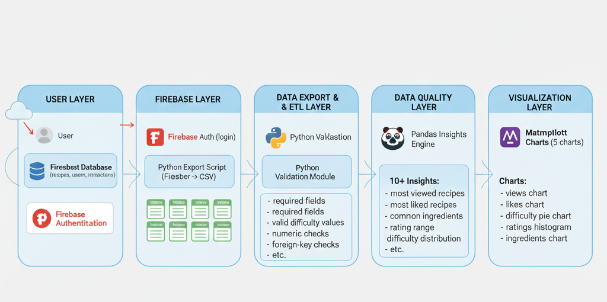
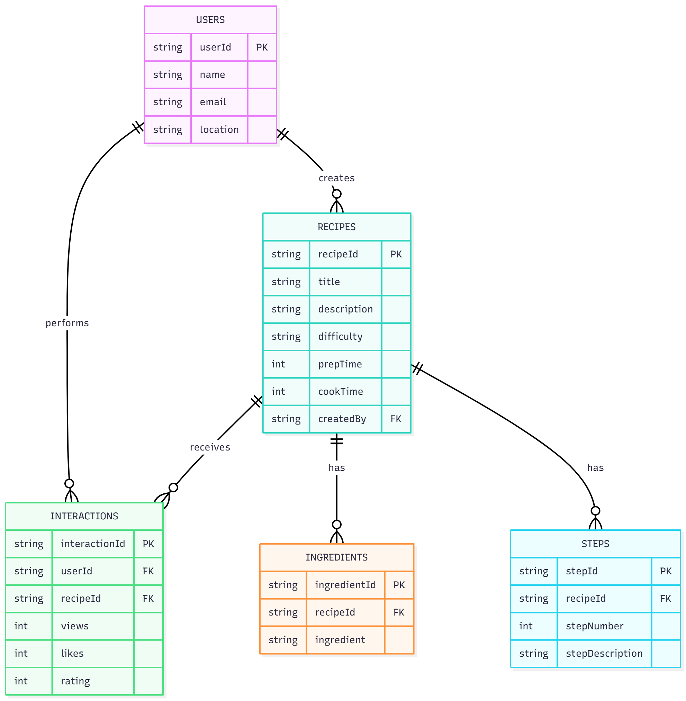
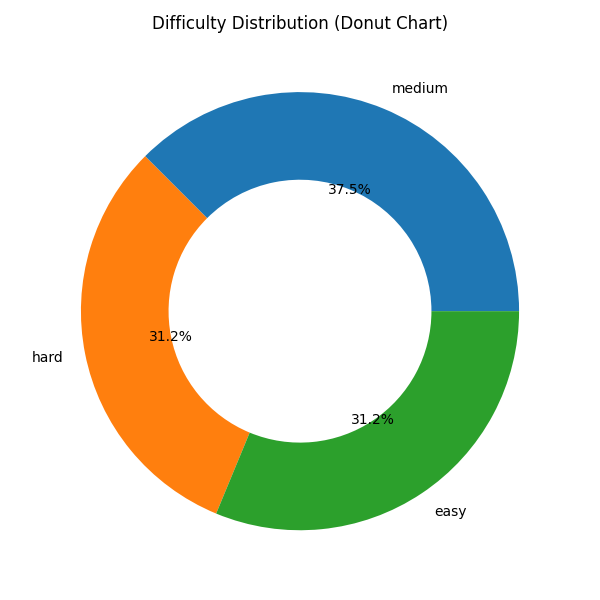
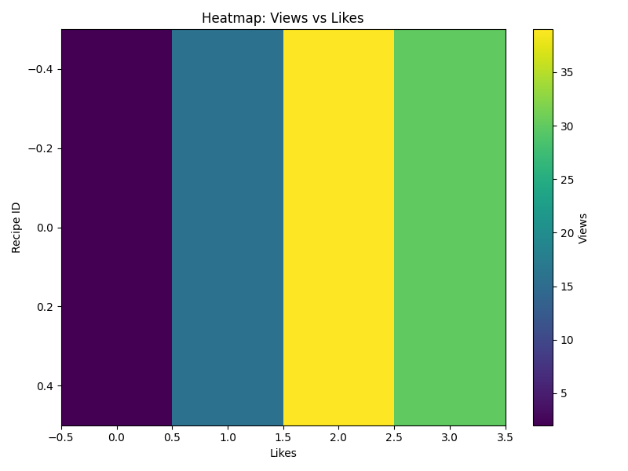
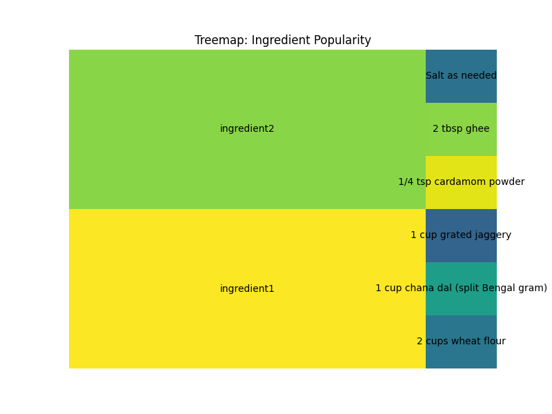
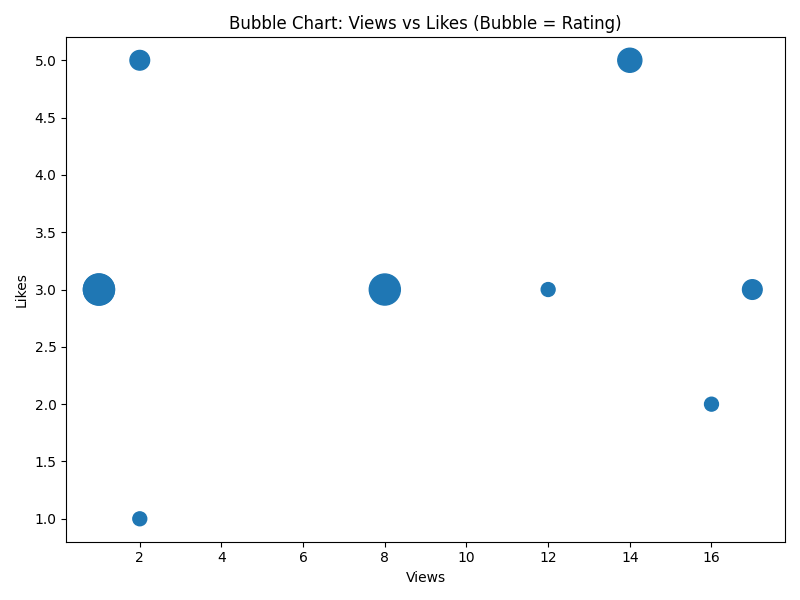

# Recipe Analytics Pipeline with Firestore  
A complete end-to-end Data Engineering project using **Firebase Firestore**, **Python ETL**, **Data Validation**, **Analytics**, and **Matplotlib Visualizations**.

---

## Overview  
This project demonstrates a real-world **Data Engineering pipeline** built on top of a recipe analytics platform.  
The system collects recipe-related data in Firestore, exports it into structured CSVs, validates data quality,  
performs analytics, and generates visual insights.

The pipeline includes:

- Firebase → CSV Data Extraction  
- Data Quality Validation  
- Normalized Dataset Creation  
- Analytics & Insight Generation  
- Matplotlib Visualizations  
- ER & Architecture Diagrams  

---

## Project Architecture  
This diagram shows the entire workflow from Firestore → ETL → Validation → Analytics → Charts.



---

## ER Diagram  
The ER diagram represents relationships between **Users**, **Recipes**, **Ingredients**, **Steps**, and **Interactions**.



---

## Folder Structure
```
recipe_analytics_pipeline/
│
├── README.md
├── .gitignore
│
├── data/
│   ├── recipe.csv
│   ├── ingredients.csv
│   ├── steps.csv
│   ├── users.csv
│   ├── interactions.csv
│
├── etl/
│   ├── export_firestore_to_csv.py
│   ├── seed_firestore.py
│   └── (ServiceAccountKey.json removed for security)
│
├── Validation/
│   ├── validate_data.py
│   └── validation_report.txt
│
├── analytics/
│   ├── analytics_report.py
│   ├── analytics_charts.py
│   ├── insights_report.csv
│   ├── insights_report.txt
│
│   ├── Charts/
│   │   ├── chart_boxplot_ratings.png
│   │   ├── chart_bubble_views_likes_rating.png
│   │   ├── chart_correlation_matrix.png
│   │   ├── chart_difficulty_donut.png
│   │   ├── chart_heatmap_views_likes.png
│   │   ├── chart_preptime_vs_cooktime.png
│   │   ├── chart_treemap_ingredients.png
│   │   └── chart_user_activity.png
│
├── Diagrams/
│   ├── Architecture_Diagram.png
│   └── ER_Diagram.png
│
└── requirements.txt
```

---

## Firestore Setup  

Below is the detailed structure of all Firestore collections used in this project.

### **1. users Collection**
| Field        | Type      | Description |
|--------------|-----------|-------------|
| userId       | string    | Unique ID for the user |
| name         | string    | Full name of the user |
| email        | string    | User email address |
| createdAt    | timestamp | Account creation time |
| country      | string    | User location (optional) |

---

### **2. recipes Collection**
| Field         | Type      | Description |
|---------------|-----------|-------------|
| recipeId      | string    | Unique ID for the recipe |
| name          | string    | Recipe name |
| description   | string    | Short description |
| difficulty    | string    | easy / medium / hard |
| prep_time     | number    | Preparation time (mins) |
| cook_time     | number    | Cooking time (mins) |
| total_time    | number    | Total time (mins) |
| createdBy     | string    | userId of recipe creator |
| createdAt     | timestamp | Timestamp when recipe was added |

---

### **3. ingredients Collection**
| Field        | Type      | Description |
|--------------|-----------|-------------|
| ingredientId | string    | Unique ingredient ID |
| recipeId     | string    | Link to recipes.recipeId |
| ingredient   | string    | Ingredient name |
| quantity     | string    | Quantity used (e.g., "2 cups") |

---

### **4. steps Collection**
| Field     | Type      | Description |
|-----------|-----------|-------------|
| stepId    | string    | Unique step ID |
| recipeId  | string    | Link to recipes.recipeId |
| step_num  | number    | Step number |
| instruction | string  | Description of the cooking step |

---

### **5. interactions Collection**
| Field     | Type      | Description |
|-----------|-----------|-------------|
| interactionId | string | Unique interaction ID |
| userId    | string    | Link to users.userId |
| recipeId  | string    | Link to recipes.recipeId |
| views     | number    | Total views by the user |
| likes     | number    | Like (0/1) |
| rating    | number    | Rating 1–5 |
| commented | boolean   | Whether user left a comment |
| createdAt | timestamp | Interaction time |

---


## Seed Firestore with sample recipe data:

```bash
python etl/seed_firestore.py
```

---

## ETL: Export Firestore to CSV  
This script extracts Firestore data and saves it into structured CSV files.

```bash
python etl/export_firestore_to_csv.py
```

Outputs:
- recipe.csv  
- ingredients.csv  
- steps.csv  
- users.csv  
- interactions.csv  

---

## Data Validation  
Ensures data completeness & consistency.

Run:
```bash
python Validation/validate_data.py
```

Generates:
- `validation_report.txt`

---

## Analytics & Insights  
Run:
```bash
python analytics/analytics_report.py
```

Outputs:
- insights_report.csv  
- insights_report.txt  

---

## Key Visualizations  
Below are 4 selected charts that best represent the dataset and insights.

---

### **1. Difficulty Distribution (Donut Chart)**


---

### **2. Heatmap: Views vs Likes**


---

### **3. Treemap: Ingredient Popularity**


---

### **4. Bubble Chart: Views vs Likes vs Rating**


---

## Summary  
This project showcases a complete data engineering pipeline using Firebase as the NoSQL backend and Python for ETL, validation, analytics, and visualization.

It reflects industry-level best practices including:
- Modular ETL scripts  
- Data quality enforcement  
- Statistical insights  
- Professional visualizations  
- Clean architecture  
- Well-documented project structure  

---

##  References

- Firebase Firestore Documentation  
  https://firebase.google.com/docs/firestore

- Firestore Security Rules  
  https://firebase.google.com/docs/firestore/security/get-started

- Firebase Admin SDK (Python)  
  https://firebase.google.com/docs/admin/setup

- Pandas Documentation  
  https://pandas.pydata.org/docs/

- Matplotlib Documentation  
  https://matplotlib.org/stable/


## Author  
**Ritesh More**  
*riteshmore2702@gmail.com*  
Recipe Analytics Pipeline – Data Engineering Project
